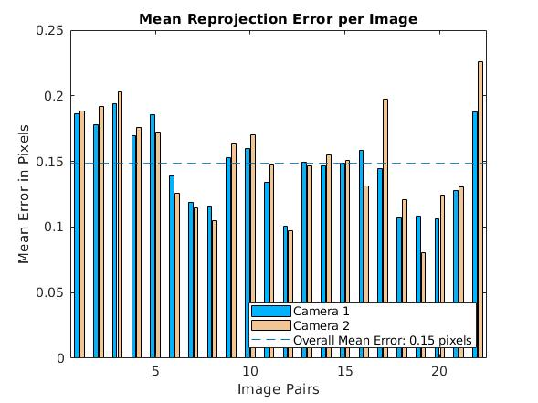
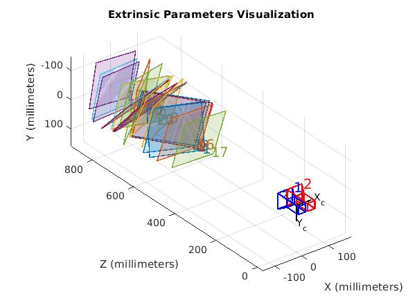
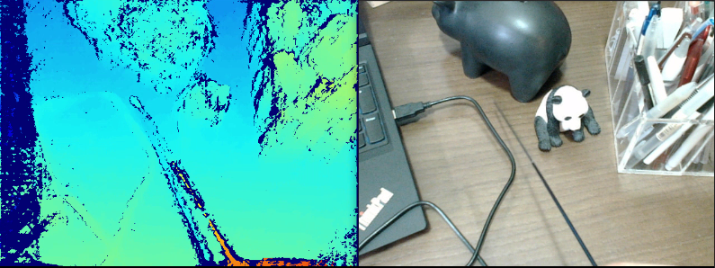
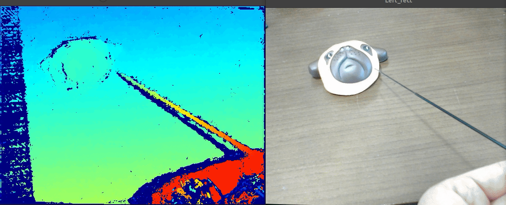

# StereoVision

This project is a toolkit for stereo camera.

## Dependecy
Tested with:
- OpenCV 4.5.0
- CUDA 11.1
- libSGM


## Build
```
mkdir build
cd build
cmake .. -DCMAKE_BUILD_TYPE=Release
make -j8
```
## Stereo Camera Calibration
1. **Get image for Calibration**: After compiling the code, all the executable will be store in ./bin folder. 
```
./bin/get_photos -w <chess_board_width> -h <chess_board_height> -d <where_to_store>
```
This command will show the views of your stereo camera and detected chess board. You can press the `s` to save the image by , and `space` to exit.

For example: if you plan to use chess board with weight=7, height=10, and store the left image in ./images/left/, store the right image in ./images/right/
```
./bin/get_photos -w 7 -h 10 -d ./images
```
2. **Calibration using matlab**: In matlab run `./matlab/calibratoin.m`, which use calculate  all the camera parameters and stored in `./config`. Note matlab only support the chess board that has asymmetric with even-odd side length.
   
   

   - `cam_left.yml/cam_right.yml`: Intrinsic for left/right camera
      - `K`: Camera matrix.
      - `D`: [Distortion coefficients](https://docs.opencv.org/master/dc/dbb/tutorial_py_calibration.html) e.g.[k1 k2 p1 p2 k3].
   - `extrinsic.yml`: The extrinsic between left and right
      - `R`: Rotation matrix between two camera
      - `T`: Translation

3. **Rectification** :
To calculate the rectification transformation matrices. Three output file `./config/reuslt.yml` `./config/left.yml` `./config/reuslt.yml`.
```
./bin/rectification
```
- `Q`: the 4x4 disparity-to-depth mapping matrix
- `R1`:	the 3x3 rectification transform (rotation matrix) for the left camera. 
- `R2`:	the 3x3 rectification transform (rotation matrix) for the right camera. 
- `P1`: the 3x4 projection matrix in the new (rectified) coordinate systems for the left camera, i.e. it projects points given in the rectified left camera coordinate system into the rectified left camera's image.
- `P2`:	the 3x4 projection matrix in the new (rectified) coordinate systems for the right camera, i.e. it projects points given in the rectified left camera coordinate system into the rectified right camera's image.

## Depth Estimation
```
./bin/depth <camera index>
```
Example: disparity image from stereo camera using SGM[1](CUDA implmentation by [libSGM](https://github.com/fixstars/libSGM))



## Worth Mention:
- `P1`: constant penalty for small disparity changes(i.e. 1 pixel)
- `P2`: constant penalty for large disparity changes


[1] Hirschmüller, Heiko. 2007. “IEEE TRANSACTIONS ON PATTERN ANALYSIS AND MACHINE INTELLIGENCE Stereo Processing by Semi-Global Matching and Mutual Information,”

## TODO
- [ ] Example of disparity image will be add
- [ ] Disparity postprocessing
- [x] SGM CUDA support
- [ ] Python depth.cpp implementation to support the PyTorch model for depth estimation.


